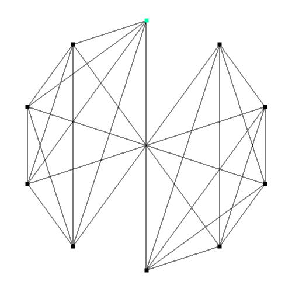
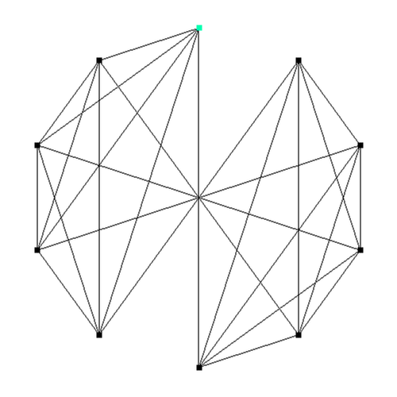
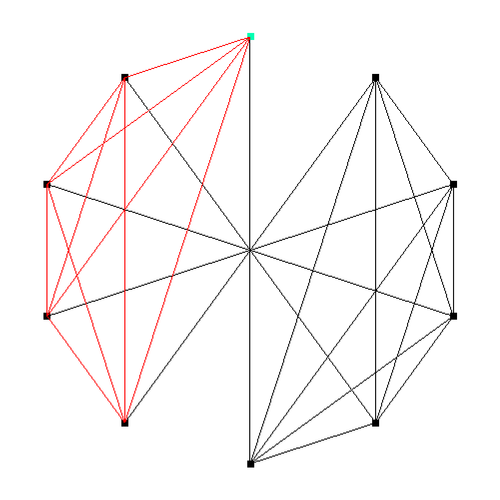

# The maximal cliques finding with Bron–Kerbosch algorithm

The project code implements the Bron–Kerbosch algorithm for finding maximal cliques in an undirected graph and visualize results.



The algorithm uses branch and bound approach for efficient maximal cliques finding. For details see original [publication](http://dl.acm.org/citation.cfm?doid=362342.362367) by Bron C., Kerbosh J. (1973). Visualisation was realized with the GLFW library.

*Originally, the project was developed in Dec 2014.*

## Content of this repo

- `scr/test/main.c` code for testing without visualisation
- `scr/vis/main.cpp` final project code
- `examples` directory with sample input files graphs for quick testing
- `clique.exe` precompiled project code.

## How to run the code
### Precompiled program
For quick start you can run the precompiled `clique.exe` file (with two arguments: paths to the input and output files) as following:

```
clique.exe examples\graf2.txt output2.txt
```

It was tested on Win 7/8/10.

### Source code
Feel free to examine the sourse code in the `scr` directory and compile it on your own with your favourite compiler. It will need the open [GLFW](http://www.glfw.org/) library.

### The input file format

The input file should be an ordinary text file. The first row should contain only one number - number of vertices. **64** vertices is the maximum! The following lines should describe the graph connectivity. 1 in i-th row on j-th place means that the i-th vertices is connected with the j-th (j>i). Here it is an example (*graf2.txt*):

```
10
1 1 1 1 1 0 0 0 0 
1 1 1 0 1 0 0 0 
1 1 0 0 1 0 0 
1 0 0 0 1 0 
0 0 0 0 1 
1 1 1 1  
1 1 1 
1 1 
1 
```



The first vertice is marked in color. Vertices are numbered counterclockwise.

### The output file format

In the described above example there are 2 same size maximal cliques. They are printed out in the output file as following:

```
Full connected group:
1 2 3 4 5 
6 7 8 9 10 
Total 2 groups with 5 vertices.
```

Press *Enter* button to see results visualisation (or to switch between maximal cliques if there is more then one solutio) and *Escape* to close the program.




## Authors
- __Nikolay Falaleev__ - *The main author* Github: [NikolasEnt](https://github.com/NikolasEnt), Twitter: [@NFalaleev](https://twitter.com/NFalaleev)
